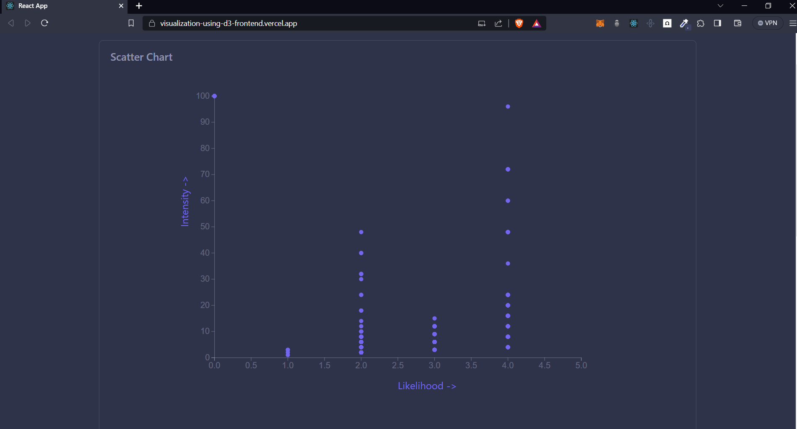
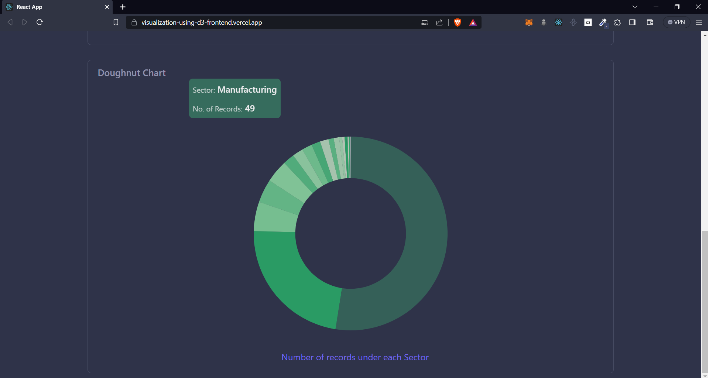

# Overview

This is a small project to practice and implement d3.js to create charts (not responsive) using some a data source(it is a mock data). The data is being fetched from an API (created using Node.js and Express.js) on the intitial render.

Please see the app <a href="https://visualization-using-d3-frontend.vercel.app/">here.</a>

## Tech stack

- HTML5
- CSS3
- Tailwind CSS
- React
- D3.js
- Node.js
- Express.js
- MongoDB

## My Takeaways

- Learned how to plot charts using d3 selectors and SVG(s), and how to set multiple attributes in it like the type of the chart, how to plot data on the chart and add axes and labels and much more.

## Screenshots

